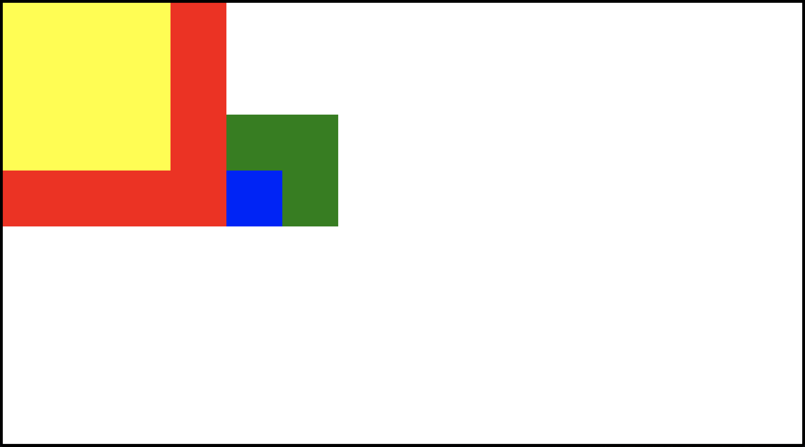
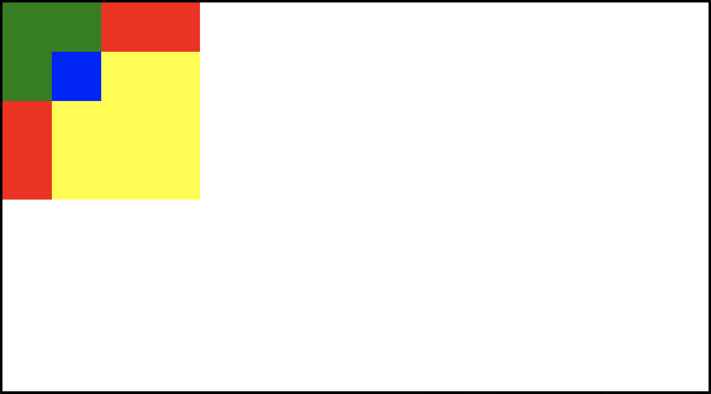
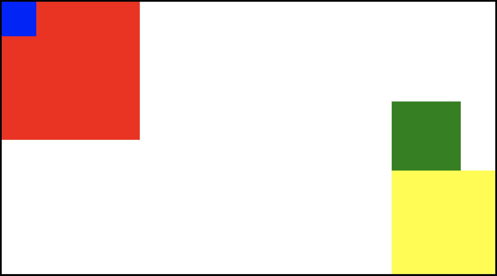
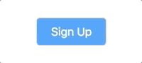

# CSS Assignment

This is a three-part assignment. Check the `starter-code` folder to get started on part I. Check the `solutions` folder to check your work.

## Part I - CSS Positioning

In this exercise, you've got an HTML file with a few divs inside of the `body` tag. Your goal is to modify the CSS so that you can make the page look like each of the following screenshots.

You should ONLY be modifying the CSS in this exercise: don't change anything in the HTML file!

For a lot of these, there are many different ways to acheive the desired layout. Try to focus on using _positioning_, rather than other CSS concepts like margins, flexbox, or floats.

### Exercise 1

### Exercise 2

### Exercise 3

### Exercise 4

### Exercise 5

## Part II - CSS Mocks

In this exercise, your goal is to create the three design elements depicted below. You can choose your own images for the later mocks, but otherwise you should try to make the styling as close to what you see as possible. Most importantly, don't use any external CSS libraries, and no JavaScript! You should be writing all of the CSS you need yourself.

### Mock 1

### Mock 2

### Mock 3

## Part III - Bootstrap

There are a number of sample layouts you can build with Bootstrap on the Bootstrap website. In this exercise, your goal is to build one of the layouts below from scratch. Here are your options:

1.  [Album](https://getbootstrap.com/docs/4.0/examples/album/)
2.  [Cover](https://getbootstrap.com/docs/4.0/examples/cover/)
3.  [Carousel](https://getbootstrap.com/docs/4.0/examples/carousel/)
4.  [Dashboard](https://getbootstrap.com/docs/4.0/examples/dashboard/)

Here are some guidelines:

1.  **Avoid looking at the Elements tab.** If you don't know how to acheive some part of the layout, head to the Bootstrap documentation first. You should be able to find anything you need there. Only look to the Elements tab as a last resort.
2.  **Minimize the amount of CSS you write.** One of the biggest upsides to using bootstrap is that it allows to concentrate on content, and worry less about styling issues. So for this exercise, try to write as little of your own CSS as possible. You may not be able to eliminate your own CSS entirely, but see how far you can get without writing a line of CSS.
3.  **Customize the look to suit your preferences!** You should take these designs as sources of inspiration, but feel free to play around with colors, margins, etc. Flexibility here will require you to take a look at the Bootstrap docs to understand how Bootstrap classes are actually working, and it'll allow you to build a layout that's a little more personal.
4.  **If you finish one layout and have time, start another!**
